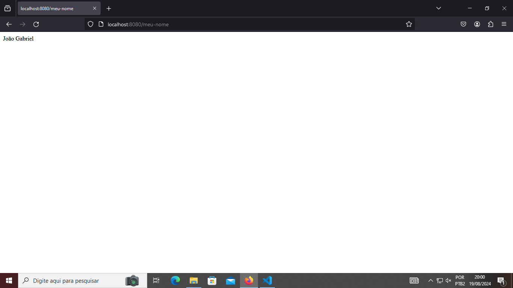

# Tecnologia_pra_back-end
Cadeira de estudos back-end usando a linguagem java do professor Kelson Victor

# Exercício 1

Olá professor, eu estou sentindo uma extrema dificuldade em usar diversas ferramentas no mesmo código, sei que é errado e que minha organização falhou, mas tentarei compensar nas próximas atividades, não devo justificar pelas atitudes que fiz, mas tive problemas com banco de dados no meu computador, não tive tanto tempo para ver as videoaulas, não entendi o insomnia.

Mas o que consegui extrair dessa atividade foi:

@RestController: Indica que a classe será um controlador REST, ou seja, responsável por lidar com requisições HTTP e respostas JSON.
Rota /alunos com @RequestMapping: Define que todas as operações relacionadas a "alunos" serão mapeadas para o endpoint /alunos.
Método de criação de aluno com @PostMapping: O método que cria um novo aluno será acessado através de requisições HTTP POST.

    @RequestBody: Utilizado para receber o corpo da requisição em formato JSON, que é transformado em um objeto Aluno.
    @ResponseStatus(HttpStatus.CREATED): Define que o status de resposta será HTTP 201 (Created) após a criação bem-sucedida de um novo aluno.

@Entity: Indica que a classe Aluno é uma entidade JPA que será armazenada em um banco de dados.
Chave primária com @Id: Define o campo id como a chave primária.

    Geração automática de IDs com @GeneratedValue(strategy = GenerationType.IDENTITY): Configura a chave primária para ser gerada automaticamente

@Service: Marca a classe como um serviço, que contém a lógica de negócios relacionada ao gerenciamento de alunos.    
JpaRepository: A interface AlunoRepository herda da JpaRepository, o que significa que ela possui os métodos padrão de CRUD (Create, Read, Update, Delete) sem a necessidade de implementação manual.
